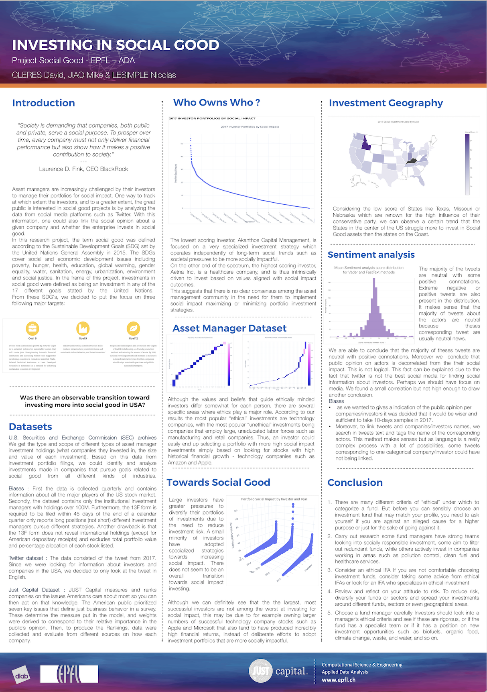

# Investing for Social Good

Check out [our website](https://dcleres.github.io/investing_for_social_good) for our data story, and interactive visualizations. 

Check out [our notebook](https://github.com/dcleres/investing_for_social_good/blob/master/milestone_3_notebook.ipynb) to see the process and computation behind our project. 

# Poster

# Abstract
*"Society is demanding that companies, both public and private, serve a social purpose. To prosper over time, every company must not only deliver financial performance but also show how it makes a positive contribution to society."* - Laurence D. Fink, CEO BlackRock (largest asset manager in the world)

Asset managers are increasingly challenged by their investors to manage their portfolios for social impact. However, it is non-trivial for investors and investment managers to maintain regular oversight over the social impact composition of their portfolios. The U.S. Securities and Exchange Commission’s (SEC’s) EDGAR maintains a digital record of the portfolio filings of publicly traded asset managers. All the News is a Kaggle dataset of news articles primarily from 2016 to 2017. 

Furthermore, it could be interesting to correlate the greater public's interest into social good projects expressed on social media platforms such as Twitter and Facebook, or news platforms, with the actual investments that are done. 

# Research questions
- How to map news article sentiments to specific investments held by companies?
- What are the most popular “ethical” or “unethical” investments held by asset managers?
- What asset managers have the portfolios with the greatest/least social impact?
- What is the great public's opinion regarding the companies that held many investments in social good versus those who do not invest in social good? 
  - How to make a ranking of “public opinion” regarding a company?
- Was there a transition toward investing more into social good then into other projects? If yes, when did it happen?
- Can we extend the project to other countries in other to build a global social good investment chart? 

# Dataset
List the datasets containing the information needed to answer the above-mentioned questions: 

- [The news](https://www.kaggle.com/snapcrack/all-the-news/home)

- [SEC asset manager portfolios](https://www.sec.gov/cgi-bin/browse-edgar?company=&CIK=&type=13F&owner=include&count=40&action=getcurrent)
- Twitter : 1% of the tweets of 2017 - On the ADA Cluster

Once the project topic was chosen, the group spent a considerable amount of time to look at the quality of the data. For the members, it was important to make sure that the time allocated to the project will be spent on data science and information extraction and not data cleaning.

Our group found some libraries to generate a .csv-like file listing, by company and date, the URLs in the SEC's archives where the [investment portfolio filings](https://github.com/edouardswiac/python-edgar) are stored as consistently structured text and HTML table data. We will be able to programmatically extract the type and scope of different types of asset manager investment holdings (what companies they invested in, the size and value of each investment). This data can be enriched by processing additional news and social data related to portfolio companies into signals of their social impact and mapping these social impact signals to investment portfolios. Based on this data from investment portfolio filings, we hope to be able to identify and analyze investments made in companies that pursue goals related to *social good* from all different kinds of industries. 

Regarding the dataset on Kaggle, we took a closer look to the comments made about the data and we found no issues. Moreover, the download of the 3 .csv files was done. The structure is well defined with several columns (title, publication, author, data, year, month, URL, content). The size of the dataset is small. 

The Twitter data is a dataset provided by the course so we are confident that there should not be too many insolvable issues and the data does not look *too bad*. The documentation of Twitter API was analyzed to understand how to use this database. First, determination of a dictionary of keywords linked to our subject will be done (and possibly Machine Learning algorithms will be used to broaden it throughout work process). Finally, the tweets will be filtered thanks to the buolt dictionary in order to construct the dataset of interest.

# Contributions
* **David Cleres:** Data collection, cleaning, and visualization for Twitter Data and Stock location data, Website with Data Story, Website styling, Website site writing pages, and website correction, final presentation.
* **Nicholas Lesimple:** Data cleaning, visualization for Twitter Data, sentiment analysis processing, Website writing pages and Website site correction, final presentation.
* **Mike Jiao:** Data collection, cleaning, and visualization for SEC 13F filings, final presentation.

Everyone will work on the final presentation to make the poster and structure it. Then one of us will be taken to present the work.

# A list of internal Milestones of the project

### Milestone 1 (MS1) 
- [x] Create a README of the project
- [x] Register the project on the Course Webform

### Milestone 2 Objectives (MS2) - *A notebook with data collection and descriptive analysis, properly commented, and the notebook ends with a more structured and informed plan for what comes next*
- Task Group 0
  - [x] Download the required data
  - [x] Set up the Git and Project plan
- Prepare Milestone 2 
  - [x] Comment and debug the code : *Through the homeworks, we learnt how to work together as a team of 3 students. Throughout this learning process we also learnt which comments in the code are useful for the other members of the team and which comments were not that usefull. Obviously, this process is not over but we got way better than in week 1.*
  - [x] Learn from the mistakes made in M1
  - [x] Set clear goals and plans for the next milestone : *see [here](https://github.com/dcleres/investing_for_social_good/projects/1)*
- Task Group 1 - Data Exploration
  - [x] Clean and organize our data
  - [x] NaN values, how can we deal with bots and spam etc. (Read papers that might give us interesting insights)
  - [x] Establish a process for performing tests and evaluations on smaller parts of the dataset and understanding to what extent we will need to work within the frameworks of the cluster
  - [x] Understand how the cluster works
- Task Group 2 - Data Exploitation
  - [x] Explore data visualization possibilities
  - [ ] Decide which visualizations formats serve the best our purpose.
  - [x] Exploration of pre-trained simple Natural Language Processing (NLP) methods (LSI, pLSI, LDA and VSM using lemmatization, stemming and n-grams) to perform analysis on the Twitter and news datasets.
  - [ ] Determine a dictionary of keywords linked to emotion and opinion identifiers regarding companies. 
  - [x] Perform data wrangling and preprocessing.
- Task Group 3 - Wrapping up MS1  
  - [x] Process and perform a detailed analysis of the news and SEC datasets, filtering out the relevant data and understand how to combine the two datasets with the information on Twitter for instance.
  - [In progress] Find trends in the data regarding the social opinion to the investors and correlate it with the findings regarding the investments done by companies. 
    
### Milestone 3 Objectives (MS3) - Final Milestone
- Feedback from MS2: Due to the large number of projects that the group is accumulating through the different classes that each group member is taking, we decided to adopt a very structured approach for this project. We took advantage of GitHub's possibility to define issues, to assign them and to label them. Therefore at each meeting tried to summarize in a few issues the task to do until the next meeting. The tickets can be seen [here](https://github.com/dcleres/investing_for_social_good/projects/1). This second milestone was marked by the fact that we also had Homework 4 to handle in parallel. However, we succesfully managed to work on both tasks. Nevertheless, it is obvious that the working hours put into the project were restrained. From the objectives set in MS1, the one labelled with the check are the objectives what we managed to finish at 100%. The ones wihtout check are either in progress or had to be delayed to the 3rd milestone since they came too early in the pipeline. The work that was performed in MS1 is contained in [this notebook](https://github.com/dcleres/investing_for_social_good/blob/master/milestone_2_notebook.ipynb). 
- From the knowledge acquired in MS1, we were able to define the following goals for the next milestone: 
  - Task Group 1 - Tasks left from MS1 
    - [x] Determine a dictionary of keywords linked to emotion and opinion identifiers regarding companies
    - [X] Decide which visualizations formats serve the best our purpose when the data will be shown on the online platform of choice
      - See on D3.JS --> [D3 Force-Directed Graph](https://beta.observablehq.com/@mbostock/d3-force-directed-graph). Make one plot for the investors and in which domain they do invest. 
      - Just for fun : https://bl.ocks.org/mbostock/3231298
      - Interesting idea : https://www.theguardian.com/world/interactive/2013/feb/12/state-of-the-union-reading-level
  - Task Group 2 - Implementation of an Online Platform for the data story 
    - [X] Collect information about flask 
    - [X] Collect information about ReactJS
    - [X] Explore informations about Jekyll
    - [X] Explore the hosting opportunities of GitHub Pages (free solution) 
    - [X] Find a suitable layout that works with the project 
    - [X] Organise the content of the webpage (find goos titles and enhance the user experience while being on the website
  - Task Group 3 - Sentiment Analysis - *This task was started in MS2. However, we need to be careful about the implementation since being mentionned positively on Twitter or in the News does not necessarily mean that the company is investing in social good. Therefore, to have a proper scoring we need more then the 2 weeks (and homework 4) that we had until now.*
    - [x] NLP enhencement for Twitter dataset 
    - [ ] NLP enhencement for News dataset [CANCELLED]
    - [ ] Integration of this information in the score calculation [CANCELLED]
    - [x] Comparison of this information on the score
  - Task Group 4 - Answer to the Research Questions 
    - [X] Answer the questions
    - [X] Define the biases of our analysis
     
#### Questions for TA's

- What technologies do professional data blogs like FiveThirtyEight use for visualization?\
    **ANSWER** : *For fancy visualisation, you can use D3.js, for simple one you can use some wrappers of D3.js (C3.js)* 
- Is the content we have enough to make a project?\
    **ANSWER** :  *You seem to have enough content for now. Once you start exploring the dataset you can reiterate on your research questions and refine them if needed.*
